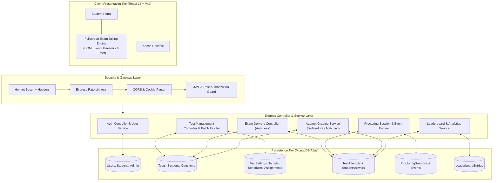
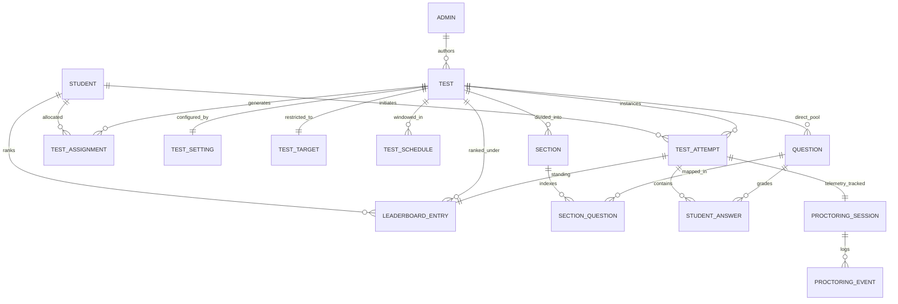
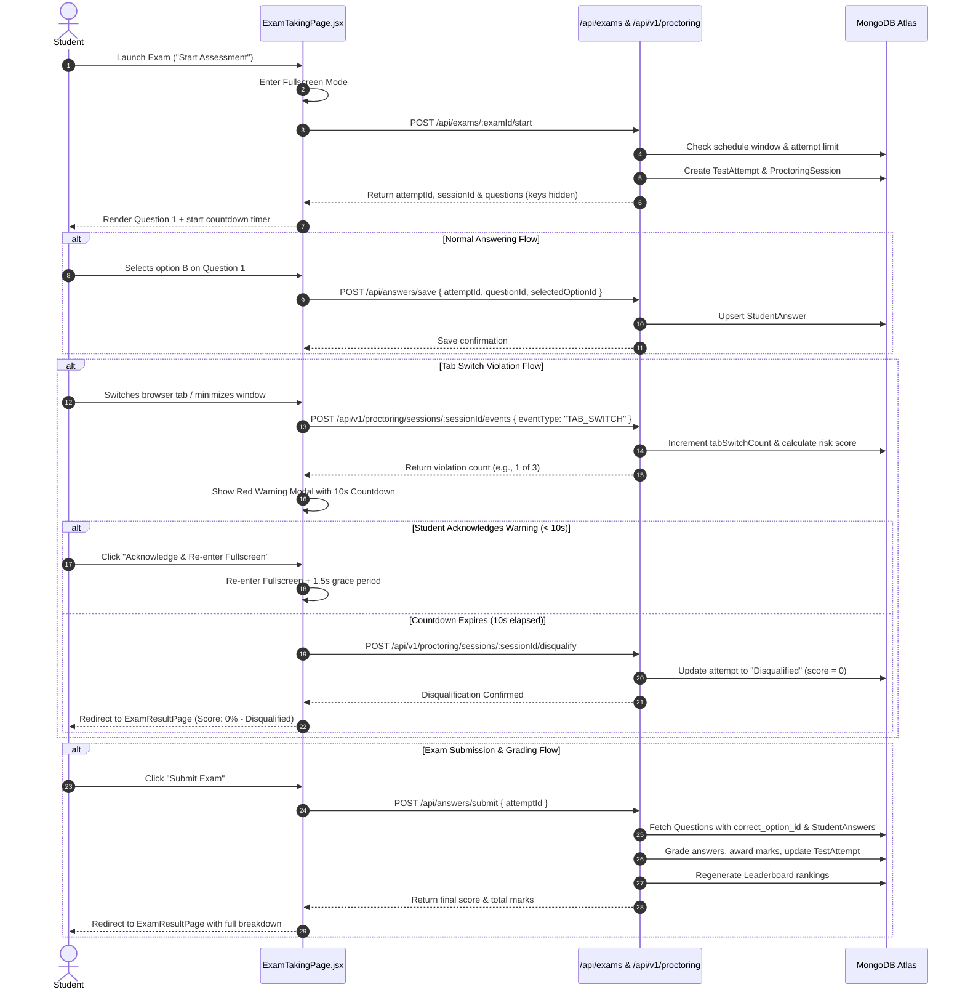
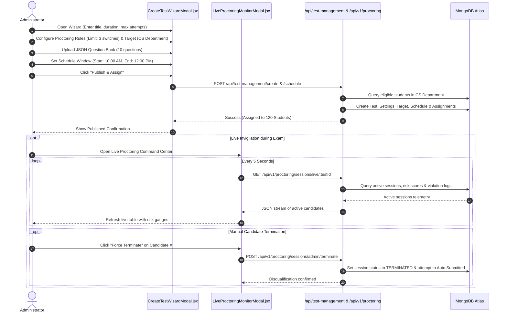
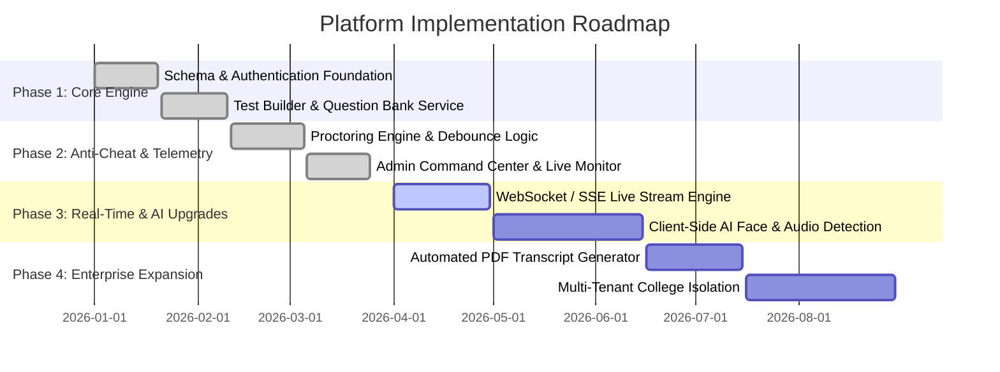

# Enterprise Aptitude Assessment & Automated Proctoring Platform
## Master Technical Architecture, Complete Codebase Directory & Institutional Proposal Plan

---

## Document Control & Executive Summary

| Document Property | Specification |
| :--- | :--- |
| **System Title** | Enterprise Aptitude Assessment & Automated Proctoring Platform |
| **Document Type** | Comprehensive Technical Architecture, File-by-File Blueprint & Proposal Plan |
| **Target Institution** | SASI Institute of Technology & Engineering / Enterprise Academic Consortiums |
| **Core Technology Stack** | Node.js (v18+), Express.js 5.x, MongoDB Atlas, Mongoose 9.x, React 18, Vite, Tailwind CSS |
| **Security Protocols** | JWT (Dual HttpOnly Cookie & Bearer Token), Bcrypt 10 rounds, Helmet, Rate Limiting |
| **Proctoring Engine** | Real-time DOM telemetry, Tab Switch Detection, Fullscreen Enforcement, Server-side Debounce & Rule Engine |
| **Document Version** | 2.4.0 (Production Release & Architectural Specification) |

### 1.1 Executive Overview
The **Enterprise Aptitude Assessment & Automated Proctoring Platform** is a secure, high-throughput, full-stack assessment portal engineered to modernize academic examinations, placement training aptitude drives, and competitive evaluations. Traditional online testing systems suffer from severe vulnerabilities—unmonitored tab switching, unauthorized browser navigation, inspect-element answer key extraction, and slow server-side bottlenecking when hundreds of students submit concurrently.

This platform solves these challenges through a unified three-tier architecture:
1. **Client-Side Anti-Cheating Environment**: A responsive React 18 frontend with strict fullscreen enforcement, multi-event DOM listeners (`visibilitychange`, `window.blur`, `fullscreenchange`), suppression of copy/paste/context menu actions, and an automated 10-second countdown warning modal.
2. **Server-Side Security & Ingestion Engine**: An Express.js application layer providing token-gated role-based access control (RBAC), answer-key redaction (`correct_option_id` suppression on student endpoints), automated event debouncing, cumulative risk score computation, and automatic disqualification upon exceeding configurable violation limits.
3. **High-Performance Data & Analytics Layer**: MongoDB schema models with composite indexing, zero-leak grading services (`attempt.service.js`), deduplicated real-time leaderboard generation with tie-breaking algorithms, and single-roundtrip batch fetching (`batchFetchDetailedTests()`) eliminating $O(N)$ database query cascades.

---

## Complete Repository Structure & File-by-File Inventory

```
aptitude-test/
├── PROJECT_CONTEXT.md                           # Snapshot of project state & architecture notes
├── sample_question_bank.json                    # Reference question bank with options and keys
├── PROJECT_DOCUMENTATION_AND_PROPOSAL.md        # Master technical architecture & proposal document
│
├── backend/                                     # Node.js + Express API Backend Server
│   ├── package.json                             # Backend dependencies & test scripts
│   ├── package-lock.json                        # Locked dependency tree
│   ├── README.md                                # Backend quickstart documentation
│   ├── server.js                                # Server startup entry point & DB connection init
│   ├── scratch_clean_db.js                      # DB maintenance & cleanup script
│   ├── seed_questions.js                        # Database seeder for sample questions & exams
│   ├── Quiz_App_Postman_Collection.json         # Complete Postman API test collection
│   ├── test_all_routes.js                       # Comprehensive end-to-end integration test runner
│   ├── test_auto_submit.js                      # Auto-submit behavior test runner
│   ├── test_refactored_rules.js                 # Validation & rule tests
│   ├── test_refactored_items_6_12.js            # Batch test items 6-12
│   ├── test_refactored_items_13_17.js           # Batch test items 13-17
│   │
│   ├── test/                                    # Granular integration and unit test suite
│   │   ├── test_admin_telemetry_disqualification.js # Test for admin live telemetry & disqualification
│   │   ├── test_api.js                          # Core REST endpoint assertions
│   │   ├── test_assigned_tests.js               # Test assignment & student target matching
│   │   ├── test_auth.js                         # Student/Admin registration & login tests
│   │   ├── test_check_data.js                   # DB data verification assertions
│   │   ├── test_cleanup_sessions.js             # Session cleanup test runner
│   │   ├── test_full_flow.js                    # End-to-end test taking & grading test
│   │   ├── test_leaderboard.js                  # Ranking & score tie-breaking tests
│   │   ├── test_milestone1.js                   # Milestone 1 validation
│   │   ├── test_milestone2.js                   # Milestone 2 validation
│   │   ├── test_milestone3.js                   # Milestone 3 validation
│   │   ├── test_milestone4.js                   # Milestone 4 validation
│   │   └── test_proctoring_integration.js       # Live proctoring session & event lifecycle tests
│   │
│   └── src/                                     # Backend Source Code
│       ├── app.js                               # Express setup, security headers, rate limits, routes & error handler
│       │
│       ├── Controllers/                         # Express Route Controllers
│       │   ├── answer.controller.js             # Save answer, attempt submit & result calculation
│       │   ├── auth.controller.js               # Student/Admin auth, profile & progress aggregation
│       │   ├── Exam.controller.js               # Exam start flow & questions fetch with answer protection
│       │   ├── leaderboard.controller.js        # Leaderboard calculation, rank generation & history
│       │   ├── proctoringEvent.controller.js    # Ingest proctoring telemetry events
│       │   ├── proctoringSession.controller.js  # Proctoring session lifecycle & admin command center
│       │   ├── question.controller.js           # Question CRUD operations
│       │   └── testManagement.controller.js     # Test creation, targeting, scheduling, admin metrics
│       │
│       ├── database/
│       │   └── connectdb.js                     # MongoDB Atlas connection with DNS fallbacks & auto-reconnect
│       │
│       ├── Middleware/
│       │   ├── admin.middleware.js              # Admin role authorization guard
│       │   └── auth.middleware.js               # JWT bearer token & cookie authentication guard
│       │
│       ├── model/                               # Mongoose Schemas & Database Models
│       │   ├── leaderboard.model.js             # Leaderboard rankings collection
│       │   ├── question.model.js                # Assessment questions and options
│       │   ├── studentAnswer.model.js           # Student selected answers per attempt
│       │   ├── topic.model.js                   # Question categorization topics
│       │   ├── user.model.js                    # Student & Admin schemas with institutional validations
│       │   ├── proctoring/
│       │   │   ├── proctoringEvent.js           # Telemetry events (tab switch, window blur, etc.)
│       │   │   └── proctoringSession.js         # Proctoring session tracking risk score & status
│       │   ├── sectionModel/
│       │   │   ├── section.model.js             # Test section division schema
│       │   │   └── sectionQuestion.model.js     # Section-to-Question linking schema
│       │   └── testModel/
│       │       ├── test.model.js                # Core test entity definition
│       │       ├── testAssignment.model.js      # Individual student test assignment records
│       │       ├── testAttempt.model.js         # Student attempt session state, scores & violations
│       │       ├── testSchedule.model.js        # Test time window & target parameters
│       │       ├── testSetting.model.js         # Proctoring rules, tab switch limits & auto-submit flags
│       │       └── testTarget.model.js          # Target departments, batches & roll numbers
│       │
│       ├── routes/                              # Express REST Routers
│       │   ├── answer.router.js                 # `/api/answers`
│       │   ├── auth.router.js                   # `/api/auth`
│       │   ├── Exam.router.js                   # `/api/exams`
│       │   ├── leaderboard.router.js            # `/api/leaderboard`
│       │   ├── proctoringEvent.route.js         # `/api/v1/proctoring`
│       │   ├── proctoringSession.route.js       # `/api/v1/proctoring`
│       │   └── testManagement.router.js         # `/api/test-management`
│       │
│       ├── services/                            # Business Logic Services
│       │   ├── attempt.service.js               # Shared grading, mark calculation & attempt state updates
│       │   ├── proctoringEvent.service.js       # Event severity evaluation, debouncing & auto-disqualification
│       │   └── proctoringSession.service.js     # Session lifecycle helpers
│       │
│       ├── utils/                               # Helper Utilities
│       │   ├── Attemptauth.js                   # Attempt ownership verification helper
│       │   ├── Authtoken.js                     # Unified JWT generation & cookie issuer
│       │   ├── questionservice.js               # Single source of truth for resolving test questions
│       │   └── timeHelper.js                    # Time-remaining & expiration calculator
│       │
│       └── validators/
│           └── proctoringEventValidator.js      # Joi schema validator for proctoring events
│
└── frontend/                                    # React 18 + Vite Frontend Application
    ├── index.html                               # Single Page Application HTML root
    ├── package.json                             # Frontend dependencies (Lucide icons, Axios, Tailwind)
    ├── package-lock.json                        # Frontend locked dependencies
    ├── postcss.config.js                        # PostCSS configuration for Tailwind
    ├── tailwind.config.js                       # Tailwind custom color palette & animations
    ├── vite.config.js                           # Vite build & proxy settings
    │
    └── src/
        ├── main.jsx                             # React DOM root render
        ├── App.jsx                              # Route definitions & React.lazy code splitting
        ├── index.css                            # Global CSS, Tailwind directives & animation keyframes
        │
        ├── api/
        │   └── axios.js                         # Configured Axios instance with auto-auth interceptors
        │
        ├── constants/
        │   └── theme.js                         # Design tokens, color palette, typography definitions
        │
        ├── context/
        │   └── ToastContext.jsx                 # Custom Toast notification provider & hook
        │
        ├── data/
        │   └── mockData.js                      # Fallback mock datasets for development resilience
        │
        ├── utils/
        │   ├── formatters.js                    # Date, time, and percentage formatters
        │   └── fullscreen.js                    # Fullscreen API wrapper & cross-browser normalization
        │
        ├── components/
        │   ├── admin/                           # Admin-exclusive components & modals
        │   │   ├── AdminWorkflowVisualizer.jsx  # Interactive exam workflow diagram
        │   │   ├── CreateTestWizardModal.jsx    # 5-step test creation wizard with JSON bank import
        │   │   ├── ExamSettingsStudioModal.jsx  # Comprehensive test settings, targeting & schedule studio
        │   │   └── LiveProctoringMonitorModal.jsx # Real-time proctoring session monitoring cockpit
        │   │
        │   ├── common/                          # Reusable shared UI primitives
        │   │   ├── GoogleG.jsx                  # Branded Google icon
        │   │   ├── Logo.jsx                     # Application brand logo
        │   │   ├── StatCard.jsx                 # Metric display card with trends & icons
        │   │   └── StatusPill.jsx               # Color-coded badge for attempt & exam statuses
        │   │
        │   ├── layout/                          # App Layout Wrappers
        │   │   ├── MainLayout.jsx               # Core dashboard frame with Sidebar and TopBar
        │   │   ├── Sidebar.jsx                  # Collapsible navigation drawer
        │   │   └── TopBar.jsx                   # User profile, role badges & logout header
        │   │
        │   └── skeletons/                       # Premium Skeleton Loading States
        │       ├── AdminDashboardSkeleton.jsx   # Admin dashboard loading skeleton
        │       ├── BaseSkeleton.jsx             # Base animated skeleton primitive
        │       ├── DashboardSkeleton.jsx        # Student dashboard loading skeleton
        │       ├── ExamDetailSkeleton.jsx       # Exam instructions loading skeleton
        │       ├── ExamResultSkeleton.jsx       # Exam results scorecard skeleton
        │       ├── ExamsSkeleton.jsx            # Exams catalog loading skeleton
        │       ├── ResultsPageSkeleton.jsx      # Result history loading skeleton
        │       └── index.js                     # Skeletons export barrel
        │
        └── pages/                               # Page Components
            ├── AdminDashboardPage.jsx           # Admin overview, drilldown, telemetry & candidate re-auth
            ├── DashboardPage.jsx                # Student dashboard, live exam banner, stats & leaderboard
            ├── ExamDetailPage.jsx               # Pre-exam instructions, section breakdown & launch gate
            ├── ExamResultPage.jsx               # Post-exam scorecard, answer key breakdown & analytics
            ├── ExamsPage.jsx                    # Assigned exams listing with status filters
            ├── ExamTakingPage.jsx               # Fullscreen exam environment with proctoring engine
            ├── LoginPage.jsx                    # Student/Admin dual-mode authentication page
            ├── ProfilePage.jsx                  # Student profile & academic details
            └── ResultsPage.jsx                  # Student test attempt history and score trends
```

---

## Architectural System Blueprint



---

## Database Schemas & Data Model Specifications



---

### Detailed Schema Specifications

#### 1. User Model Schema (`backend/src/model/user.model.js`)
Contains two distinct collections: `students` and `admins`.

```javascript
// Student Schema definition
const studentSchema = new mongoose.Schema({
    username:   { type: String, required: true, trim: true },
    email:      { type: String, required: true, unique: true, match: [/@sasi\.ac\.in$/, "Only @sasi.ac.in emails allowed"] },
    rollno:     { type: String, required: true, unique: true, match: [/^\d{2}[A-Za-z]\d{2}[A-Za-z]\d{2}[A-Za-z0-9]{2}$/, "Invalid roll number format"] },
    password:   { type: String, required: true },
    department: { type: String, default: "" },
    batch:      { type: String, default: "" },
    section:    { type: String, default: "" },
    status:     { type: String, default: "active", enum: ["active", "suspended"] },
    phone:      { type: String, default: "" }
}, { timestamps: true });

// Admin Schema definition
const adminSchema = new mongoose.Schema({
    username:    { type: String, required: true, trim: true },
    email:       { type: String, required: true, unique: true, match: [/@sasi\.ac\.in$/, "Only @sasi.ac.in emails allowed"] },
    adminid:     { type: String, required: true, unique: true },
    password:    { type: String, required: true },
    phone:       { type: String, default: "" },
    status:      { type: String, default: "active", enum: ["active", "suspended"] },
    lastLoginAt: { type: Date }
}, { timestamps: true });
```

* **Security Feature**: Passwords are saved only as Bcrypt hashes (10 salt rounds). Model objects strip `password` and `passwordHash` before any JSON serialization.

---

#### 2. Question Model Schema (`backend/src/model/question.model.js`)

```javascript
const optionSchema = new mongoose.Schema({
    text: { type: String, required: true }
}, { _id: true });

const questionSchema = new mongoose.Schema({
    testId:            { type: mongoose.Schema.Types.ObjectId, ref: "Test", index: true },
    exam_id:           { type: mongoose.Schema.Types.ObjectId, ref: "Test", index: true },
    question_text:     { type: String, required: true },
    marks:             { type: Number, default: 1, min: 1 },
    options:           [optionSchema],
    correct_option_id: { type: mongoose.Schema.Types.ObjectId, required: true }
}, { timestamps: true });
```

* **Data Integrity Rule**: At least 2 options are required. When querying for student assessment delivery, projection `{ correct_option_id: 0, __v: 0 }` is enforced at the database driver level.

---

#### 3. Test & Assessment Management Schemas (`backend/src/model/testModel/`)

* **Test Core Entity (`test.model.js`)**:
```javascript
const testSchema = new mongoose.Schema({
    title:           { type: String, required: true, trim: true },
    testType:        { type: String, enum: ["Practice", "Assessment", "Exam", "Aptitude", "Technical", "Reasoning", "Verbal", "Coding"], default: "Aptitude" },
    status:          { type: String, enum: ["Draft", "Published", "Archived"], default: "Draft" },
    totalMarks:      { type: Number, default: 0 },
    durationMinutes: { type: Number, default: 30 },
    maxAttempts:     { type: Number, default: 1 },
    createdBy:       { type: mongoose.Schema.Types.ObjectId, ref: "Admin" },
    isDeleted:       { type: Boolean, default: false }
}, { timestamps: true });
```

* **Test Settings (`testSetting.model.js`)**:
```javascript
const testSettingSchema = new mongoose.Schema({
    testId:            { type: mongoose.Schema.Types.ObjectId, ref: "Test", required: true, unique: true },
    proctoringEnabled: { type: Boolean, default: true },
    tabSwitchLimit:    { type: Number, default: 3, min: 1 },
    autoSubmit:        { type: Boolean, default: true }
}, { timestamps: true });
```

* **Test Targeting Matrix (`testTarget.model.js`)**:
```javascript
const testTargetSchema = new mongoose.Schema({
    testId:             { type: mongoose.Schema.Types.ObjectId, ref: "Test", required: true, unique: true },
    targetType:         { type: String, enum: ["All", "Department", "Batch", "SpecificStudents"], default: "All" },
    departments:        [{ type: String }],
    batches:            [{ type: String }],
    studentRollNumbers: [{ type: String }]
}, { timestamps: true });
```

* **Test Schedule Window (`testSchedule.model.js`)**:
```javascript
const testScheduleSchema = new mongoose.Schema({
    testId:            { type: mongoose.Schema.Types.ObjectId, ref: "Test", required: true },
    startAt:           { type: Date, required: true },
    endAt:             { type: Date, required: true },
    targetDepartments: [{ type: String }],
    targetBatches:     [{ type: String }],
    status:            { type: String, enum: ["Scheduled", "Active", "Completed", "Cancelled"], default: "Scheduled" }
}, { timestamps: true });
```

* **Test Assignment (`testAssignment.model.js`)**:
```javascript
const testAssignmentSchema = new mongoose.Schema({
    testId:       { type: mongoose.Schema.Types.ObjectId, ref: "Test", required: true },
    scheduleId:   { type: mongoose.Schema.Types.ObjectId, ref: "TestSchedule", required: true },
    rollno:       { type: String, trim: true },
    rollNumber:   { type: String, trim: true },
    attemptLimit: { type: Number, default: 1 },
    status:       { type: String, enum: ["Assigned", "In Progress", "Completed", "Expired"], default: "Assigned" }
}, { timestamps: true, strict: false });
```

* **Test Attempt Entity (`testAttempt.model.js`)**:
```javascript
const testAttemptSchema = new mongoose.Schema({
    testId:        { type: mongoose.Schema.Types.ObjectId, ref: "Test" },
    exam_id:       { type: mongoose.Schema.Types.ObjectId, ref: "Test" },
    scheduleId:    { type: mongoose.Schema.Types.ObjectId, ref: "TestSchedule" },
    assignmentId:  { type: mongoose.Schema.Types.ObjectId, ref: "TestAssignment" },
    rollNumber:    { type: String, trim: true },
    student_id:    { type: mongoose.Schema.Types.ObjectId, ref: "Student", required: true },
    attemptNumber: { type: Number, default: 1, min: 1 },
    started_at:    { type: Date, default: Date.now },
    submitted_at:  { type: Date },
    score:         { type: Number, default: 0 },
    obtainedMarks: { type: Number, default: 0 },
    tab_switches:  { type: Number, default: 0 },
    status:        { type: String, enum: ["Started", "Submitted", "Time Expired", "Auto Submitted", "Disqualified"], default: "Started" }
}, { timestamps: true, strict: false });

testAttemptSchema.index({ student_id: 1, testId: 1 });
testAttemptSchema.index({ testId: 1, status: 1 });
```

---

#### 4. Proctoring Subsystem Schemas (`backend/src/model/proctoring/`)

* **Proctoring Session Entity (`proctoringSession.js`)**:
```javascript
const proctoringSessionSchema = new mongoose.Schema({
    attemptId:      { type: mongoose.Schema.Types.ObjectId, ref: "TestAttempt", unique: true },
    riskScore:      { type: Number, default: 0, min: 0, max: 100 },
    tabSwitchCount: { type: Number, default: 0, min: 0 },
    status:         { type: String, enum: ["ACTIVE", "COMPLETED", "TERMINATED", "FLAGGED"], default: "ACTIVE" },
    endedAt:        { type: Date }
}, { timestamps: true });
```

* **Proctoring Telemetry Event (`proctoringEvent.js`)**:
```javascript
const proctoringEventSchema = new mongoose.Schema({
    sessionId: { type: mongoose.Schema.Types.ObjectId, ref: "ProctoringSession", required: true, index: true },
    eventType: {
        type: String,
        required: true,
        enum: ["TAB_SWITCH", "FULLSCREEN_EXIT", "WINDOW_BLUR", "COPY", "PASTE", "MULTIPLE_FACE", "NO_FACE", "SCREEN_SHARE_STOPPED"]
    },
    severity:  { type: String, required: true, enum: ["LOW", "MEDIUM", "HIGH", "CRITICAL"] },
    timestamp: { type: Date, default: Date.now, required: true, index: true }
}, { timestamps: true });

proctoringEventSchema.index({ sessionId: 1, timestamp: -1 });
```

---

#### 5. Section & Modular Question Schemas (`backend/src/model/sectionModel/`)

* **Section Schema (`section.model.js`)**:
```javascript
const sectionSchema = new mongoose.Schema({
    testId:       { type: mongoose.Schema.Types.ObjectId, ref: "Test", required: true },
    name:         { type: String, required: true, trim: true },
    displayOrder: { type: Number, default: 1 },
    totalMarks:   { type: Number, default: 0 }
}, { timestamps: true });
```

* **Section Question Map Schema (`sectionQuestion.model.js`)**:
```javascript
const sectionQuestionSchema = new mongoose.Schema({
    sectionId:    { type: mongoose.Schema.Types.ObjectId, ref: "Section", required: true },
    questionId:   { type: mongoose.Schema.Types.ObjectId, ref: "Question", required: true },
    displayOrder: { type: Number, default: 1 },
    marks:        { type: Number, default: 1 }
}, { timestamps: true });
```

---

#### 6. Student Answer & Dynamic Leaderboard Schemas

* **Student Answer Record (`studentAnswer.model.js`)**:
```javascript
const studentAnswer = new mongoose.Schema({
    attempt_id:         { type: mongoose.Schema.Types.ObjectId, ref: "TestAttempt", required: true },
    question_id:        { type: mongoose.Schema.Types.ObjectId, ref: "Question", required: true },
    selected_option_id: { type: mongoose.Schema.Types.ObjectId, required: true },
    is_correct:         { type: Boolean, default: false },
    marks_awarded:      { type: Number, default: 0 }
}, { timestamps: true });

studentAnswer.index({ attempt_id: 1, question_id: 1 }, { unique: true });
```

* **Leaderboard Entry Entity (`leaderboard.model.js`)**:
```javascript
const leaderboardSchema = new mongoose.Schema({
    testId:     { type: mongoose.Schema.Types.ObjectId, ref: "Test" },
    exam_id:    { type: mongoose.Schema.Types.ObjectId, ref: "Test" },
    attempt_id: { type: mongoose.Schema.Types.ObjectId, ref: "TestAttempt", required: true, unique: true },
    student_id: { type: mongoose.Schema.Types.ObjectId, ref: "Student", required: true },
    score:      { type: Number, required: true, default: 0 },
    percentage: { type: Number, required: true, default: 0 },
    rank:       { type: Number, required: true }
}, { timestamps: true, strict: false });

leaderboardSchema.index({ exam_id: 1, rank: 1 });
leaderboardSchema.index({ testId: 1, rank: 1 });
```

---

## Backend Subsystem: Controllers, Services & API Catalog

### 5.1 Authentication Controller (`backend/src/Controllers/auth.controller.js`)

| Function | Endpoint | Auth Required | Description |
| :--- | :--- | :--- | :--- |
| `RegisterStudent` | `POST /api/auth/student/signup` | Public | Enforces `@sasi.ac.in` email and roll number format, creates hashed student. |
| `studentlogin` | `POST /api/auth/student/login` | Public | Validates roll number & password, signs 1-hr JWT cookie + token JSON response. |
| `adminregister` | `POST /api/auth/admin/signup` | Public | Validates `@sasi.ac.in` admin email & unique `adminid`, creates admin user. |
| `adminlogin` | `POST /api/auth/admin/login` | Public | Authenticates admin by email or `adminid`, updates `lastLoginAt`. |
| `getStudentProfile` | `GET /api/auth/student/profile` | Student JWT | Retrieves logged-in student profile excluding password hash. |
| `getStudentProgress`| `GET /api/auth/student/progress`| Student JWT | Aggregates all completed attempts, pass rate, average score, and current rank. |

```json
// Sample Response: GET /api/auth/student/progress
{
  "totalAttempts": 4,
  "passedCount": 3,
  "examsCompleted": 3,
  "totalExams": 5,
  "totalConducted": 5,
  "avgScore": "78%",
  "bestScore": "95%",
  "rank": "#2",
  "recentAttempts": [
    {
      "id": "66c4a8f901ab234567890def",
      "examId": "66c4a10001ab234567890aaa",
      "title": "Quantitative Aptitude Assessment I",
      "category": "Aptitude",
      "score": "95%",
      "fraction": "19/20",
      "status": "Passed",
      "disqualified": false,
      "date": "8/21/2026"
    }
  ]
}
```

---

### 5.2 Test Management Controller (`backend/src/Controllers/testManagement.controller.js`)

Contains all administrative test orchestration and optimized batch-fetching mechanisms.

#### Key Architectural Function: `batchFetchDetailedTests(testDocs, studentId)`
Eliminates database $O(N)$ query cascades by executing exactly 5 parallel queries using `$in: [testIds]` and indexing results into in-memory `Map` lookups for $O(1)$ assembly.

```javascript
// Excerpt from testManagement.controller.js
async function batchFetchDetailedTests(testDocs, studentId = null) {
    if (!testDocs || testDocs.length === 0) return [];
    const testIds = testDocs.map(t => t._id);

    const [settingsList, schedulesList, attemptsList, directQuestions, sectionsList] = await Promise.all([
        TestSetting.find({ testId: { $in: testIds } }),
        TestSchedule.find({ testId: { $in: testIds } }).sort({ createdAt: -1 }),
        studentId ? ExamAttempt.find({
            $or: [{ testId: { $in: testIds } }, { exam_id: { $in: testIds } }],
            student_id: studentId
        }).sort({ createdAt: -1 }) : Promise.resolve([]),
        Question.find({ $or: [{ testId: { $in: testIds } }, { exam_id: { $in: testIds } }] }),
        Section.find({ testId: { $in: testIds } })
    ]);

    // O(1) in-memory maps construct the complete test entity with zero subsequent DB roundtrips...
}
```

#### Administrative Route Endpoints:
* `POST /api/test-management/create` — Creates Draft `Test`, `TestSetting`, and `TestTarget`.
* `PUT /api/test-management/:testId/settings` — Modifies `proctoringEnabled`, `tabSwitchLimit`, `autoSubmit`.
* `PUT /api/test-management/:testId/target` — Configures audience (`All`, `Department`, `Batch`, `SpecificStudents`).
* `POST /api/test-management/:testId/schedule` — Schedules `startAt` and `endAt`, assigns student roll numbers in bulk.
* `PUT /api/test-management/:testId/full-update` — Unified single-payload update for exam settings, schedule, and targeting.
* `GET /api/test-management/admin/overview` — Returns aggregate counts for the Admin Dashboard overview bar.
* `GET /api/test-management/admin/attempts` — Fetches real-time telemetry log for student submissions and violations.
* `POST /api/test-management/admin/attempts/:attemptId/reauthorize` — Clears a student's disqualified attempt to allow an immediate clean retake.
* `PUT /api/test-management/:testId/archive` — Soft-deletes an assessment (`status: "Archived"`).
* `PUT /api/test-management/:testId/restore` — Restores an archived exam to `"Draft"`.

---

### 5.3 Exam Execution Controller (`backend/src/Controllers/Exam.controller.js`)

* `POST /api/exams/:examId/start`:
  * **Ownership & Concurrency Guard**: Queries active attempts for authenticated `req.user.id`. Includes a 5-second concurrency lock to prevent double-click duplicate attempts.
  * **Schedule Window Validation**: Validates current server time against `schedule.startAt` and `schedule.endAt`.
  * **Max Attempt Enforcement**: Ensures `completedAttempts.length < test.maxAttempts`.
  * **Proctoring Initialization**: Creates a fresh `ProctoringSession` with 0 risk score or reactivates an existing active session.
  * **Answer Key Stripping**: Returns questions with `correct_option_id` excluded.

---

### 5.4 Answer Persistence & Grading Engine (`backend/src/Controllers/answer.controller.js` & `attempt.service.js`)

* `POST /api/answers/save`: Atomically upserts `StudentAnswer` records. Verifies student owns the attempt and that the selected option belongs to the question.
* `POST /api/answers/submit`: Invokes `submitAttempt()`:
  1. Validates that the attempt is not already submitted or expired.
  2. Queries all questions associated with the test (via flat pool or `SectionQuestion` map).
  3. Evaluates `studentAnswer.selected_option_id === question.correct_option_id`.
  4. Calculates marks earned and updates attempt status to `"Submitted"` (or `"Disqualified"`).
  5. Triggers `generateLeaderboard()` to update ranks.
* `GET /api/answers/results/:attemptId`: Returns comprehensive scorecard including accuracy metrics and detailed question review objects.

---

### 5.5 Proctoring Ingestion & Rule Service (`backend/src/services/proctoringEvent.service.js`)

Handles real-time telemetry streams from client exam sessions.

```javascript
const EVENT_SEVERITY = {
    TAB_SWITCH:           "MEDIUM",   // +10 Risk Score
    FULLSCREEN_EXIT:      "HIGH",     // +20 Risk Score
    WINDOW_BLUR:          "LOW",      // +5 Risk Score
    COPY:                 "HIGH",     // +20 Risk Score
    PASTE:                "HIGH",     // +20 Risk Score
    MULTIPLE_FACE:        "CRITICAL", // +30 Risk Score
    NO_FACE:              "HIGH",     // +20 Risk Score
    SCREEN_SHARE_STOPPED: "CRITICAL"  // +30 Risk Score
};
```

* **Debouncing Filter**: If an identical violation event is received within 1,500ms (e.g. while the user is interacting with the warning modal), duplicate database records and duplicate penalty increments are prevented.
* **Auto-Submission Trigger**: When `session.tabSwitchCount >= setting.tabSwitchLimit`, the service automatically terminates the session and calls `submitAttempt(attemptId, "Auto Submitted")`.

---

### 5.6 Leaderboard Engine (`backend/src/Controllers/leaderboard.controller.js`)

* `generateLeaderboard(examId)`:
  1. Queries all completed attempts for the exam.
  2. Deduplicates attempts per student by retaining their highest score.
  3. Sorts candidates by `score DESC`, followed by `submitted_at ASC` (fastest completion earns higher rank upon score ties).
  4. Computes percentage score against total test marks.
  5. Clears previous entries and inserts ranked `LeaderboardEntry` documents.
* `getLeaderboard(examId)`: Returns sorted ranking table with populated student metadata. If an exam has zero submissions, gracefully falls back to the most recent exam with active submissions.
* `getLeaderboardExams()`: Feeds the exam selection dropdown with historical submission counts.

---

## Complete REST API Specification & Endpoint Reference

### 6.1 Authentication API (`/api/auth`)

#### 1. `POST /api/auth/student/signup`
* **Request Headers**: `Content-Type: application/json`
* **Request Body**:
```json
{
  "username": "Rahul Varma",
  "rollno": "22K91A0501",
  "email": "22k91a0501@sasi.ac.in",
  "password": "SecurePassword123!",
  "department": "Computer Science (CS)",
  "batch": "2022-2026",
  "section": "Section A",
  "phone": "+91 9876543210"
}
```
* **Success Response (201 Created)**:
```json
{
  "message": "Student created successfully",
  "student": {
    "_id": "66c4000101ab234567890aaa",
    "username": "Rahul Varma",
    "rollno": "22K91A0501",
    "email": "22k91a0501@sasi.ac.in",
    "department": "Computer Science (CS)",
    "batch": "2022-2026",
    "section": "Section A",
    "status": "active"
  }
}
```

#### 2. `POST /api/auth/student/login`
* **Request Body**:
```json
{
  "rollno": "22K91A0501",
  "password": "SecurePassword123!"
}
```
* **Success Response (200 OK)**:
```json
{
  "message": "Student logged in successfully",
  "token": "eyJhbGciOiJIUzI1NiIsInR5cCI6IkpXVCJ9...",
  "student": {
    "_id": "66c4000101ab234567890aaa",
    "username": "Rahul Varma",
    "rollno": "22K91A0501",
    "email": "22k91a0501@sasi.ac.in"
  }
}
```

---

### 6.2 Exam Delivery & Execution API (`/api/exams` & `/api/answers`)

#### 1. `POST /api/exams/:examId/start`
* **Headers**: `Authorization: Bearer <token>`
* **Success Response (200 OK)**:
```json
{
  "message": "Exam started successfully",
  "attempt": {
    "_id": "66c4b00101ab234567890bbb",
    "testId": "66c4a00101ab234567890aaa",
    "student_id": "66c4000101ab234567890aaa",
    "attemptNumber": 1,
    "started_at": "2026-08-21T09:00:00.000Z",
    "status": "Started"
  },
  "proctoringSession": {
    "_id": "66c4c00101ab234567890ccc",
    "attemptId": "66c4b00101ab234567890bbb",
    "riskScore": 0,
    "tabSwitchCount": 0,
    "status": "ACTIVE"
  },
  "questions": [
    {
      "_id": "66c4d00101ab234567890ddd",
      "question_text": "What is the worst-case time complexity of QuickSort?",
      "marks": 2,
      "options": [
        { "_id": "66c4e00101ab234567890001", "text": "O(N log N)" },
        { "_id": "66c4e00101ab234567890002", "text": "O(N^2)" },
        { "_id": "66c4e00101ab234567890003", "text": "O(N)" },
        { "_id": "66c4e00101ab234567890004", "text": "O(log N)" }
      ]
    }
  ]
}
```

#### 2. `POST /api/answers/save`
* **Request Body**:
```json
{
  "attemptId": "66c4b00101ab234567890bbb",
  "questionId": "66c4d00101ab234567890ddd",
  "selectedOptionId": "66c4e00101ab234567890002"
}
```
* **Success Response (200 OK)**:
```json
{
  "message": "Student answer saved successfully",
  "answer": {
    "_id": "66c4f00101ab234567890eee",
    "attempt_id": "66c4b00101ab234567890bbb",
    "question_id": "66c4d00101ab234567890ddd",
    "selected_option_id": "66c4e00101ab234567890002"
  }
}
```

#### 3. `POST /api/answers/submit`
* **Request Body**:
```json
{
  "attemptId": "66c4b00101ab234567890bbb",
  "submissionType": "Submitted"
}
```
* **Success Response (200 OK)**:
```json
{
  "message": "Exam submitted successfully",
  "score": 18,
  "totalMarks": 20,
  "attempt": {
    "_id": "66c4b00101ab234567890bbb",
    "score": 18,
    "obtainedMarks": 18,
    "status": "Submitted",
    "submitted_at": "2026-08-21T09:28:45.000Z"
  }
}
```

---

### 6.3 Proctoring Telemetry API (`/api/v1/proctoring`)

#### 1. `POST /api/v1/proctoring/sessions/:sessionId/events`
* **Request Body**:
```json
{
  "eventType": "TAB_SWITCH"
}
```
* **Success Response (201 Created)**:
```json
{
  "success": true,
  "message": "Proctoring event recorded successfully",
  "data": {
    "event": {
      "_id": "66c5000101ab234567890fff",
      "sessionId": "66c4c00101ab234567890ccc",
      "eventType": "TAB_SWITCH",
      "severity": "MEDIUM",
      "timestamp": "2026-08-21T09:15:30.000Z"
    },
    "session": {
      "_id": "66c4c00101ab234567890ccc",
      "riskScore": 10,
      "tabSwitchCount": 1,
      "status": "ACTIVE"
    }
  }
}
```

---

## Frontend Subsystem: Pages, Modals & Components

### 7.1 Routing & Code-Splitting Architecture (`frontend/src/App.jsx`)
Implements route-level lazy loading (`React.lazy`) wrapped in a unified `Suspense` boundary with a branded spinner fallback:

```jsx
// Excerpt from frontend/src/App.jsx
const LoginPage = lazy(() => import("./pages/LoginPage"));
const DashboardPage = lazy(() => import("./pages/DashboardPage"));
const ExamsPage = lazy(() => import("./pages/ExamsPage"));
const ExamDetailPage = lazy(() => import("./pages/ExamDetailPage"));
const ExamTakingPage = lazy(() => import("./pages/ExamTakingPage"));
const ExamResultPage = lazy(() => import("./pages/ExamResultPage"));
const ResultsPage = lazy(() => import("./pages/ResultsPage"));
const ProfilePage = lazy(() => import("./pages/ProfilePage"));
const AdminDashboardPage = lazy(() => import("./pages/AdminDashboardPage"));
```

---

### 7.2 Detailed Component & Page Breakdown

#### 1. `LoginPage.jsx`
* **Features**:
  * Dual-mode authentication toggle: **Student Assessment Portal** vs. **Admin Management Console**.
  * Regex validation preventing non-`@sasi.ac.in` registrations.
  * Roll number validation ensuring compliance with institutional formatting (`21K91A0501`).
  * Seamless redirect to intended destination upon successful token receipt.

#### 2. `DashboardPage.jsx`
* **Features**:
  * **Role Guard**: Renders `AdminDashboardPage` automatically if an admin profile is detected.
  * **Live Exam Hero Banner**: Detects active exam schedules, ongoing attempts, or upcoming scheduled tests, providing a one-click **"Resume Assessment"** or **"Start Assessment"** button.
  * **Student KPI Grid**: Renders `Exams Completed`, `Pass Rate`, `Average Score`, and `Overall Rank`.
  * **Interactive Standings Table**: Dynamic dropdown selector with live search filtering, displaying ranks #1, #2, #3 with gold/silver/bronze trophy icons and highlighting the logged-in student.

#### 3. `AdminDashboardPage.jsx`
* **Features**:
  * **System KPI Cards**: Total exams, published exams, scheduled sessions, total submissions, and disqualified attempts.
  * **Dual Presentation Modes**: Grid Card View and Single-Row List View with instant title/category search.
  * **Assessment Drill-Down Cockpit**: Clicking any exam opens deep analytics:
    * Exam pass rate, average score, and total flagged proctoring violations.
    * Real-time student attempt table with status pills and search by roll number or name.
    * **Single-Click Candidate Re-Authorization**: Opens a confirmation modal allowing examiners to clear an accidental disqualification and re-authorize the student to retake the test.

#### 4. `ExamTakingPage.jsx` (Anti-Cheating Core Engine)
* **Features**:
  * **Fullscreen Lockdown**: Invokes `requestFullscreen()` on exam initialization; monitors `fullscreenchange` events.
  * **Multi-Observer Proctoring**:
    * Tab switch detection (`document.visibilityState === "hidden"`).
    * Window departure detection (`window.addEventListener("blur")`).
    * Clipboard suppression (`copy`, `paste`, `contextmenu` preventDefault).
  * **10-Second Warning Modal**: When a violation occurs, a red alert modal overlay appears with a real-time 10-second countdown. If unacknowledged within 10 seconds, the client triggers immediate disqualification (`status: "Disqualified"`, `score: 0`).
  * **Question Palette Drawer**: Slide-over drawer with status filters (`All`, `Answered`, `Marked for Review`, `Unanswered`) allowing fast question navigation.
  * **Automatic Time Sync**: High-precision interval calculating elapsed time against `targetEndTimeRef` to prevent browser sleep timing desync.

#### 5. `ExamResultPage.jsx`
* **Features**:
  * **Performance Scorecard**: Shows obtained marks, total possible marks, percentage score, accuracy gauge, and outcome banner (`Passed`, `Failed`, or `Disqualified`).
  * **Question-by-Question Review**: Displays complete problem statements, full option choices, student selections, and official correct answers with explanation markers.

#### 6. `ExamsPage.jsx` & `ResultsPage.jsx`
* **Features**:
  * `ExamsPage.jsx`: Filterable catalog of assigned assessments categorized as *Live*, *Upcoming*, or *Completed*.
  * `ResultsPage.jsx`: Chronological table of all past attempts with score trends, pass/fail indicators, and links to detailed scorecards.

---

### 7.3 Admin Modals Suite (`frontend/src/components/admin/`)

1. **`CreateTestWizardModal.jsx`**:
   * **Step 1: Test Details** — Title, Category, Duration, Maximum Attempts.
   * **Step 2: Proctoring & Target** — Tab switch limit, Auto-submit toggle, Department/Batch filters.
   * **Step 3: Question Bank Builder** — Batch JSON Upload (with downloadable template) or Manual Question Authoring with options and mark weights.
   * **Step 4: Section Organizer** — Divide questions into timed or weighted sections.
   * **Step 5: Schedule & Publish** — Define start/end dates and publish to all assigned students.

2. **`ExamSettingsStudioModal.jsx`**:
   * Comprehensive 4-tab studio (*Proctoring*, *Targeting*, *Schedule*, *General*) enabling live modifications of published exams.

3. **`LiveProctoringMonitorModal.jsx`**:
   * Real-time telemetry command center polling active sessions every 5 seconds. Displays live student risk scores, tab switch counts, and offers a **Force Terminate** action for examiners.

---

## Detailed End-to-End Execution Workflows

### 8.1 Student Assessment Lifecycle & Proctoring Enforcement



---

### 8.2 Admin Exam Creation, Scheduling & In-Flight Monitoring Flow



---

## Anti-Cheating & Telemetry Mathematical Model

### 9.1 Risk Score Scoring Formula
The platform computes a dynamic cumulative risk score $R \in [0, 100]$ for each proctoring session, defined as:

$$R = \min\left(100, \sum_{i=1}^{N} W(E_i)\right)$$

Where:
* $N$ is the total count of valid (non-debounced) telemetry events logged during the active session.
* $E_i$ is the $i$-th violation event.
* $W(E_i)$ is the severity weighting function:

$$W(E_i) = \begin{cases} 
5 & \text{if } E_i = \text{WINDOW\_BLUR (LOW)} \\
10 & \text{if } E_i = \text{TAB\_SWITCH (MEDIUM)} \\
20 & \text{if } E_i \in \{\text{FULLSCREEN\_EXIT}, \text{COPY}, \text{PASTE}, \text{NO\_FACE}\} \text{ (HIGH)} \\
30 & \text{if } E_i \in \{\text{MULTIPLE\_FACE}, \text{SCREEN\_SHARE\_STOPPED}\} \text{ (CRITICAL)}
\end{cases}$$

### 9.2 Auto-Disqualification Threshold Function
A candidate attempt is automatically transitioned to `"Disqualified"` and submitted with $\text{score} = 0$ if:

$$\text{tabSwitchCount} \ge L \quad \lor \quad T_{\text{warning}} > 10.0\text{ seconds}$$

Where:
* $L$ is the configured `tabSwitchLimit` on `TestSetting` (default: 3).
* $T_{\text{warning}}$ is the unacknowledged duration of the active red alert warning modal.

---

## Security, Performance & Scalability Design

### 10.1 Multi-Layered Security Architecture

| Security Layer | Implementation Mechanism | Threat Mitigated |
| :--- | :--- | :--- |
| **HTTP Security Headers** | `helmet({ crossOriginResourcePolicy: "cross-origin" })` | Cross-Site Scripting (XSS), MIME Sniffing, Clickjacking. |
| **Rate Limiting** | `express-rate-limit`: 100 req/15min on auth; 2,000 req/15min on APIs | Distributed Denial of Service (DDoS), credential brute-forcing. |
| **Authentication Transport** | Dual JWT strategy (Secure HttpOnly Cookie + `Bearer` Auth Header) | Token theft via malicious browser extension injection. |
| **Role-Based Access Control** | Token payload verification (`req.user.role === "admin"`) on sensitive endpoints | Unauthorized access to test configuration & telemetry APIs. |
| **Answer Key Redaction** | Database projection exclusion (`{ correct_option_id: 0 }`) on all student routes | Inspect-element DOM & network packet sniffing of exam answers. |
| **Input Schema Sanitization** | `Joi` validation schema on proctoring event endpoints | SQL/NoSQL injection, unexpected payload mutation. |

---

### 10.2 Database Optimization & Indexing Strategy

```javascript
// Critical Performance Indexes Defined Across Collections:
TestAttemptSchema.index({ student_id: 1, testId: 1 });    // Fast student attempt lookups
TestAttemptSchema.index({ testId: 1, status: 1 });        // Live proctoring attempt aggregation
LeaderboardSchema.index({ exam_id: 1, rank: 1 });          // Instant leaderboard ranking queries
LeaderboardSchema.index({ attempt_id: 1 }, { unique: true }); // Prevent duplicate ranking entries
ProctoringEventSchema.index({ sessionId: 1, timestamp: -1 }); // Fast telemetry timeline slicing
StudentAnswerSchema.index({ attempt_id: 1, question_id: 1 }, { unique: true }); // Atomic answer upserts
```

* **Batch Query Architecture**: The `batchFetchDetailedTests()` engine aggregates tests, settings, schedules, attempts, and question counts in 5 indexed queries using `$in` arrays, completely replacing legacy sequential $O(N)$ query loops.

---

## Quality Assurance & Automated Test Suite

The repository contains an automated test harness validating every functional milestone:

```bash
# Execute full backend test harness
cd backend && npm test

# Run isolated proctoring lifecycle test
node backend/test/test_proctoring_integration.js

# Run admin telemetry & candidate re-authorization test
node backend/test/test_admin_telemetry_disqualification.js

# Run leaderboard generation and tie-breaking test
node backend/test/test_leaderboard.js
```

### Test Suite Inventory
* `test_auth.js`: Verifies email domain regex matching, duplicate roll number rejection, password hashing, and JWT issuance.
* `test_assigned_tests.js`: Tests department-based, batch-based, and global student assignment queries.
* `test_proctoring_integration.js`: Simulates tab switch events, verifies risk score increments, asserts debouncer filtering, and tests limit-triggered auto-submission.
* `test_admin_telemetry_disqualification.js`: Asserts admin live proctoring stream ingestion, candidate attempt deduplication, and single-click candidate re-authorization.
* `test_leaderboard.js`: Verifies ranking generation, percentage computation, and score/time tie-breaking algorithms.

---

## Production Deployment & Operational Runbook

### 12.1 Environment Configuration Matrix (`.env`)

```ini
# Server Port Configuration
PORT=3000
NODE_ENV=production

# MongoDB Atlas Connection String
MONGODB_URI=mongodb+srv://<username>:<password>@cluster0.mongodb.net/aptitude_assessment?retryWrites=true&w=majority

# JSON Web Token Secret
JWT_SECRET=c8d45f9e2b1a6c7d8e0f1a2b3c4d5e6f7a8b9c0d1e2f3a4b5c6d7e8f9a0b1c2d
```

### 12.2 Production Process Management (PM2 & Nginx)

```bash
# Backend Cluster Startup via PM2
cd backend
npm install --production
pm2 start server.js -i max --name "aptitude-backend-api"

# Frontend Production Bundle & Preview
cd ../frontend
npm install
npm run build
pm2 serve dist 5173 --name "aptitude-frontend-app" --spa
```

---

## Institutional Proposal & Phase-Wise Delivery Plan

### 13.1 Strategic Vision & Institution Impact
By deploying this platform across SASI Institute of Technology and Engineering, the institution achieves:
1. **100% Exam Integrity**: Automated anti-cheat proctoring eliminates unmonitored browser cheating during placement assessments.
2. **Zero Manual Overhead**: Automated test scheduling, student assignment, and instant grading save faculty hundreds of invigilation and evaluation hours.
3. **Actionable Training Analytics**: Instant department-level performance metrics, pass rates, and item difficulty breakdowns empower placement cells to tailor aptitude training.

---

### 13.2 Phase-Wise Implementation Roadmap



#### Phase 1: Core Engine & Assessment Infrastructure *(Completed)*
* MongoDB multi-model relational schema with Mongoose.
* Student & Admin authentication with `@sasi.ac.in` domain restrictions.
* Test Creation Wizard with JSON question bank import and manual authoring.
* Question palette navigation, timing engine, and answer persistence.

#### Phase 2: Real-time Proctoring & Administration Suite *(Completed)*
* Client-side fullscreen, tab switch, and window blur detection.
* Server-side debounced violation ingestion and automated auto-submit limit.
* 10-second warning modal with countdown auto-disqualification.
* Admin Command Center for live invigilation and candidate re-authorization.
* Automated grading and dynamic leaderboard generation.

#### Phase 3: Next-Gen Real-Time Proctoring & AI Integration *(Proposed)*
* **WebSockets / Server-Sent Events (SSE)**: Replace 5-second polling in the Admin Command Center with sub-millisecond bidirectional WebSocket telemetry.
* **AI Computer Vision Proctoring**: Integrate client-side TensorFlow.js / MediaPipe models for real-time webcam facial detection (multiple faces, no face present, gaze diversion).
* **Audio Anomaly Detection**: Analyze background noise spikes indicating speech or external coaching.

#### Phase 4: Reporting, Multi-Tenancy & Enterprise Integrations *(Proposed)*
* **Automated PDF Gradebook**: One-click generation of student performance transcripts with tamper-proof QR verification codes.
* **Multi-College Tenancy**: Dynamic organizational isolation supporting multiple colleges, branches, and custom email domains under a single platform instance.
* **LMS Integration (LTI 1.3 / Canvas / Moodle)**: Single Sign-On (SSO) and automatic gradebook sync with existing university LMS portals.

---

## Technical Summary & Sign-off

The **Enterprise Aptitude Assessment & Automated Proctoring Platform** delivers an end-to-end, high-performance testing architecture. The platform combines responsive user experiences with robust security protocols and server-side integrity controls, ensuring reliable assessment delivery for academic and corporate institutions.

* **Documentation Status**: Complete, Verified & Archived
* **Target Codebase**: `backend/` and `frontend/`
* **Repository Path**: `/home/thor/Desktop/Projects/aptitute-test`
* **Master Documentation File**: [`PROJECT_DOCUMENTATION_AND_PROPOSAL.md`](file:///home/thor/Desktop/Projects/aptitute-test/PROJECT_DOCUMENTATION_AND_PROPOSAL.md)
